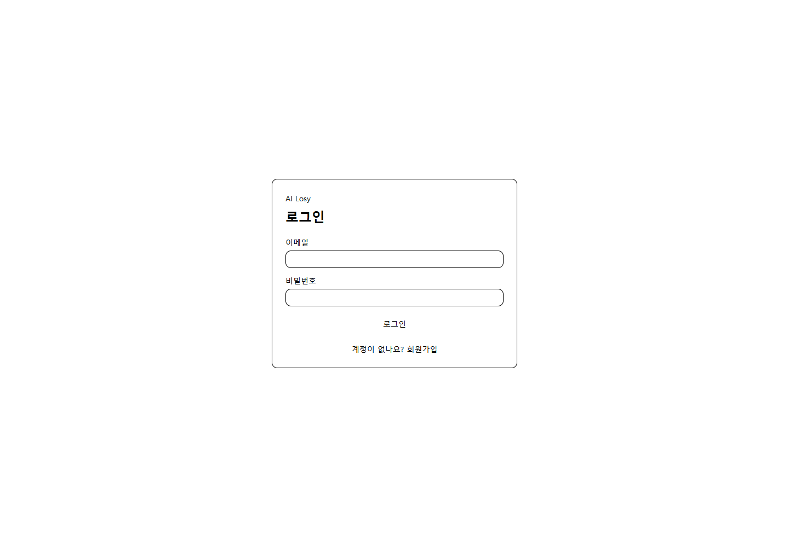
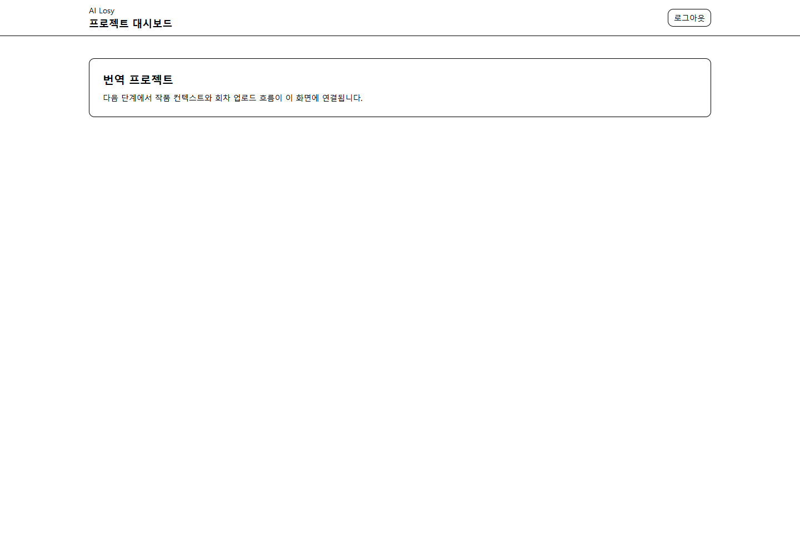
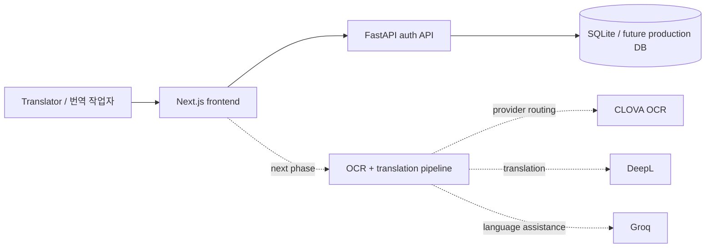

# AI Losy · Webtoon AI Translate

> **AI-assisted webtoon translation workspace / 웹툰 번역 작업을 위한 AI 보조 워크스페이스**

`webtoon-ai-translate` is a full-stack prototype for building a repeatable webtoon translation workflow around project context, OCR, translation providers, review, and export. The current checked-in implementation is intentionally described as it exists today: **authentication and the protected project-dashboard foundation are implemented; the OCR/translation production pipeline remains the next product phase.**

`webtoon-ai-translate`는 작품 컨텍스트, OCR, 번역 API, 검수, 결과물 내보내기를 하나의 흐름으로 연결하기 위한 풀스택 프로토타입입니다. 현재 저장소 기준으로는 **인증과 보호된 프로젝트 대시보드 기반까지 실제 구현되어 있고, OCR/번역 프로덕션 파이프라인은 다음 구현 단계**입니다.

## Screenshots / 구현 화면

| Login / 로그인 | Project dashboard / 프로젝트 대시보드 |
| --- | --- |
|  |  |

The screenshots above are captured from the repository's actual Next.js UI, not design mockups.

위 이미지는 별도 디자인 목업이 아니라 이 저장소의 실제 Next.js 화면을 로컬에서 실행해 캡처한 것입니다.

## Current implementation / 현재 구현 상태

### Implemented / 구현됨

- Next.js 14 App Router frontend with Tailwind/shadcn-style UI primitives
- Login and registration flows
- Protected `/dashboard` route using an access-token cookie boundary
- FastAPI backend with request logging and `/health`
- SQLite-first SQLAlchemy persistence for local development
- JWT access/refresh token issuance and `/auth/me`
- Password hashing with bcrypt/passlib
- Environment-driven provider configuration for CLOVA, DeepL, and Groq
- Architecture, AI-pipeline, database, deployment, and task planning documents under `docs/`
- Backend smoke/unit tests and frontend repository-contract tests
- GitHub Actions CI for backend tests, frontend tests/lint, and production build

### Next product phase / 다음 구현 단계

- Webtoon/project context management
- Episode/image upload workflow
- OCR extraction and speech-bubble/text-region handling
- Provider routing and translation memory
- Human review/correction workflow
- Final image/text export
- Persistent project/episode/translation models

The README deliberately separates implemented behavior from planned behavior so portfolio reviewers can tell what is working now.

README에서는 구현 완료 기능과 계획 기능을 분리해, 현재 실제로 작동하는 범위를 명확하게 확인할 수 있도록 했습니다.

## Architecture / 아키텍처



```text
webtoon-ai-translate/
├── backend/
│   ├── main.py              # FastAPI app, health check, middleware
│   ├── routers/auth.py      # register/login/refresh/me JWT API
│   ├── models/              # SQLAlchemy models
│   └── tests/               # backend automated tests
├── frontend/
│   ├── app/                 # Next.js App Router pages
│   ├── components/ui/       # reusable UI primitives
│   ├── lib/                 # API/types/helpers
│   └── tests/               # frontend repository contracts
├── docs/planning/           # architecture and pipeline design notes
└── .github/workflows/       # CI
```

## Why this project matters / 이 프로젝트의 의미

Webtoon translation is not just sentence translation. A useful production workflow has to preserve character voice, episode context, visual placement, terminology, and reviewer corrections. This project explores how to make those concerns explicit instead of treating an LLM/API call as the whole product.

웹툰 번역은 문장만 번역하는 문제가 아닙니다. 캐릭터 말투, 회차 컨텍스트, 용어 일관성, 이미지 안 텍스트 위치, 검수자의 수정 이력을 함께 다뤄야 합니다. 이 프로젝트는 단순히 번역 API를 호출하는 수준을 넘어 이러한 작업 단계를 제품 구조로 명시적으로 분리하는 것을 목표로 합니다.

## Run locally / 로컬 실행

### Backend

```bash
cd backend
python -m venv .venv
source .venv/bin/activate  # Windows PowerShell: .venv\Scripts\Activate.ps1
pip install -r requirements.txt
uvicorn main:app --reload --port 8000
```

The default development database is SQLite (`ailosy.db`). Copy `backend/.env.example` to `backend/.env` only when you need custom configuration.

### Frontend

```bash
cd frontend
npm ci
cp .env.example .env.local
npm run dev
```

Open `http://localhost:3000`. The root route redirects to `/dashboard`; unauthenticated users are redirected to `/login`.

## Validate / 검증

```bash
# frontend
cd frontend
npm test
npm run lint
npm run build

# backend
cd ..
python -m pip install -r backend/requirements.txt pytest httpx
PYTHONPATH=backend pytest -q backend/tests
```

GitHub Actions runs the same core checks on pushes and pull requests.

## Public-sharing boundary / 공개 범위

- Provider credentials must remain server-side and out of the repository.
- The repository contains `.env.example` templates only.
- Public demos should use non-sensitive sample content rather than copyrighted production webtoon assets.

## Documentation / 문서

Detailed design notes live under [`docs/planning`](docs/planning): project overview, backend/frontend architecture, AI pipeline, provider strategy, database schema, and deployment notes.

---

**Status:** foundation/prototype — authentication and dashboard shell are working; translation workflow implementation is ongoing.

**상태:** 기반 프로토타입 — 인증과 대시보드 shell은 동작하며, 실제 번역 워크플로 구현은 후속 단계입니다.
